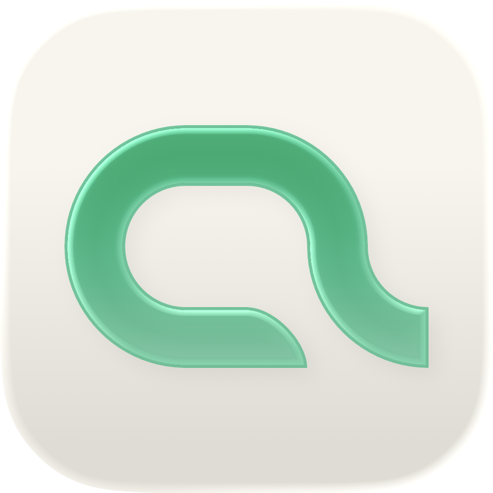

<p align="center">
  
</p>

# Dao

**Dao is an AI-native, local-first workspace for developer growth.**

Dao helps developers manage projects, tasks, notes, learning records, and long-term engineering context in one focused workspace.

## Vision

The name **Dao** comes from the Chinese concept of **道**.

In this product, Dao means more than a road or path. It represents principle, method, order, discipline, practice, and long-term mastery.

Dao is designed to support the long process of becoming a better developer.

## Why Dao?

Developer growth is not a straight line.

It is built through:

- learning
- building
- debugging
- reflecting
- organizing knowledge
- maintaining projects
- improving workflows

Dao brings these fragments into one calm, local-first workspace.

## Core Ideas

- **Local-first**: core data should be useful and accessible locally.
- **Developer-native**: keyboard-first, project-centered, searchable, and workflow-oriented.
- **Growth-focused**: designed around long-term developer growth rather than short-term task completion only.
- **AI-native**: future AI features should understand the user’s real projects, notes, tasks, and activity context.
- **Core + Extensions**: keep the core simple and add stage-specific features through official extensions.

## Tech Stack

- Electron
- React
- JavaScript
- Go
- SQLite
- HeroUI
- hugeicons
- Tiptap
- Tailwind CSS
- Zod
- JSDoc

## Current Status

Dao is currently in early development.

The first technical milestone is complete:

```txt
Electron app starts
React renders the UI
Go local service runs
SQLite stores workspace data
React displays that data
```

Current working loop:

```txt
Electron starts the Go local service
Go runs SQLite migrations
React lists workspaces
React creates workspaces
React lists projects
React creates projects
React lists tasks
React creates tasks
React lists notes
React creates notes
React searches projects, tasks, and notes
React exposes core actions through a command palette
React runs a product-shell style layout with titlebar, sidebar, file tree, active surfaces, onboarding, and settings
React is migrating the remaining shadcn-era UI pieces to HeroUI
Workspaces and projects are backed by folders in a user-selected working directory
Markdown note bodies are stored as files on disk while SQLite stores note metadata
Tiptap provides rich note editing while Markdown remains the only durable note body format
SQLite persists local metadata, search indexes, tasks, projects, workspaces, settings, and activities
```

The current renderer UI has moved from stacked MVP panels toward a real product shell. Tasks, settings, onboarding, project tree, project contents, the command palette, and the note shell use the HeroUI direction. The current note-editor milestone adds Tiptap rich editing behind a Markdown-only persistence boundary. Notes containing frontmatter, raw HTML, HTML comments, reference definitions, or footnote definitions use a safe source fallback instead of risking silent content loss.

## MVP Scope

The first version will focus on:

- Workspace
- Project
- Task
- Note
- Search
- Command Palette
- Activity Log
- Settings

## Deferred Features

These features are planned for later stages:

- AI Agent
- Cloud sync
- GitHub integration
- LeetCode extension
- Third-party plugin marketplace
- Mobile app
- Collaboration

## Roadmap

- [x] Initialize desktop app
- [x] Initialize React renderer
- [x] Initialize Go local service
- [x] Add SQLite migrations
- [x] Build workspace module
- [x] Build project module
- [x] Build task module
- [x] Build note module
- [x] Add search
- [x] Add command palette
- [x] Add activity log
- [x] Add extension system
- [x] Add initial UI foundation
- [x] Add filesystem-backed workspace/project folders
- [x] Add filesystem-backed markdown note storage
- [x] Build initial product app shell
- [ ] Finish component foundation migration to HeroUI
- [ ] Finish note editor experience
- [ ] Add AI summary features
- [ ] Add contextual AI workflow features

## Architecture

Dao follows a clear boundary between the desktop shell, UI, business logic, and local data.

```txt
Electron Main
  ├── window management
  ├── app lifecycle
  ├── preload bridge
  └── Go service process management

React Renderer
  ├── UI
  ├── routing
  ├── state management
  ├── API client
  └── command palette

Go Local Service
  ├── business logic
  ├── local HTTP API
  ├── SQLite access
  ├── search
  └── future AI workflows

SQLite
  ├── workspaces
  ├── projects
  ├── tasks
  ├── notes
  └── activities
```

For details, see [`docs/architecture.md`](./docs/architecture.md).

## Design

Dao uses a calm, jade-accented design language inspired by long-term growth and the Chinese idea of Dao.

Design principle:

```txt
Neutral-first.
Jade for intention.
```

Primary accent:

```txt
#00A86B
```

For details, see [`DESIGN.md`](./DESIGN.md).

## Documentation

- [`DESIGN.md`](./DESIGN.md) — visual identity, UI style, design tokens, and interaction tone.
- [`AGENTS.md`](./AGENTS.md) — agent instructions, coding rules, architecture guardrails, and collaboration workflow.
- [`docs/vision.md`](./docs/vision.md) — product vision, positioning, principles, and long-term shape.
- [`docs/product-plan.md`](./docs/product-plan.md) — MVP scope, module roadmap, user flows, and product milestones.
- [`docs/architecture.md`](./docs/architecture.md) — system boundaries, local service design, data model, API contracts, search, tags, and AI/vector strategy.
- [`docs/ai-harness.md`](./docs/ai-harness.md) — future AI execution layer, context, tools, permissions, validation, traces, and confirmation rules.
- [`docs/open-source-strategy.md`](./docs/open-source-strategy.md) — when and how to extract companion packages from real Dao needs.
- [`docs/development-log.md`](./docs/development-log.md) — completed milestones, current milestone context, and near-term development direction.
- [`docs/adr/0001-tiptap-markdown-editor.md`](./docs/adr/0001-tiptap-markdown-editor.md) — rich-editor choice, Markdown persistence boundary, and compatibility fallback.

## Development

Repository structure:

```txt
dao/
  apps/
    desktop/
    web/
    local-service/

  packages/
    ui/
    shared-schemas/
    extension-sdk/

  extensions/
    notes/
    tasks/
    projects/
    interview/
    leetcode/
    github/

  docs/
    vision.md
    product-plan.md
    architecture.md

  AGENTS.md
  DESIGN.md
  README.md
```

## License

MIT
